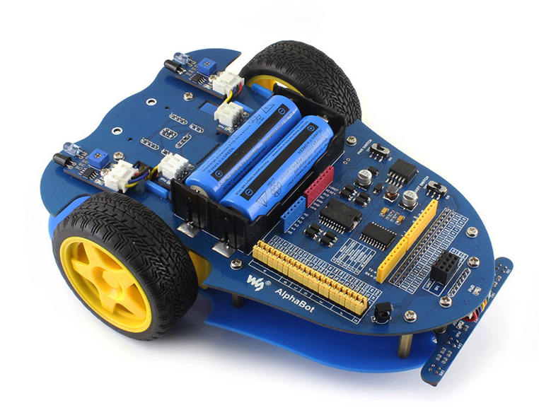
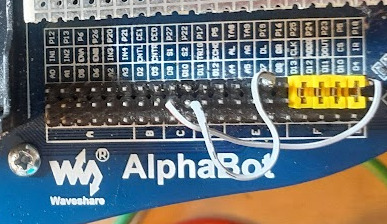
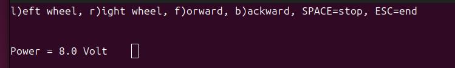

# C++ Alphabot API for the Raspberry PI

This page provides instructions how to customise the alphabot so that it's actually
usable for research and it provides a C++ API with proper setters and callbacks.



C++ class to control the basic functionality of a customised Alphabot
(https://www.waveshare.com/wiki/AlphaBot) with a Raspberry PI:

 - Motor control (using the Parallax Continuous Rotation Servo)
 - Battery voltage

## Hardware mods

### Parallax Continuous Rotation Servos

Throw the original DC motors in the bin and fit the [Parallax Continuous Rotation Servo](https://www.parallax.com/product/parallax-continuous-rotation-servo/) with 90deg brackets. Plug them into the servo ports S1 and S2.

Wire up the pin header:



```
GPIO18 / PWM2 = S1 = Motor left
GPIO19 / PWM3 = S2 = Motor right
```

### Voltage regulator

De-solder the LM2596 and throw it in the bin. It supposed to have a dropout voltage of 1V so that the 7-7.2V from the battery
should be fine but it seems to be more 2V. It's not even recommended by TI who recommend the LMR33630 for new designs.

Replace the LM2596 with a [MGS100505](https://onecall.farnell.com/cosel/mgs100505/dc-dc-converter-5v-2a/dp/4296076). Just glue it upside down on the PCB and run 4 wires to Vin and +5V.

## Software prerequisites

Add to `/boot/firmware/config.txt`:

```
dtoverlay=pwm-2chan
```

and reboot.

Check with:

```
pinctrl -p
```

that you see:

```
12: a3    pd | lo // GPIO18 = PWM0_CHAN2
35: a3    pd | lo // GPIO19 = PWM0_CHAN3
```

which corresponds to the sysfs files:

```
/sys/class/pwm/pwmchip0/pwm2: GPIO18 
/sys/class/pwm/pwmchip0/pwm3: GPIO19
```

### libgpiod

The GPIO pins are accessed via the C++ API of the `libgpiod`:

```
apt-get install libgpiod-dev
```

### ncurses
The demo programs below display the sensor
readings with the ncurses library. Install
it with
```
apt-get install libncurses-dev
```

## Building

The built system is `cmake`. Just type:
```
cmake .
make
sudo make install
```

## Usage

The online documentation is here: https://berndporr.github.io/alphabot/

### Start/stop

Start the callback reporting the battery voltage.
```
start()
```

Stop the callback.
```
stop()
```

### Motor speed

Setting the speeds of the left/right wheels:
```
setLeftWheelSpeed(float speed);
setRightWheelSpeed(float speed);
```
where speed is between -1 and +1.

### Callback

There is callback which reports the battery voltage.

## Demo programs



`testIO` is a simple test program which displays the different
senor readings and you can test the motors. It also shows
how the callback is used to display the sensor readings.

`testMotor` ramps up the motor speed and back again.

`obstacleAvoid.cpp` implements a Braitenberg vehicle
and it has an emergency stop if the digital readings from
the collision sensors are triggered. This is an
instructional example and needs to be tweaked. The
fun begins here! :)
