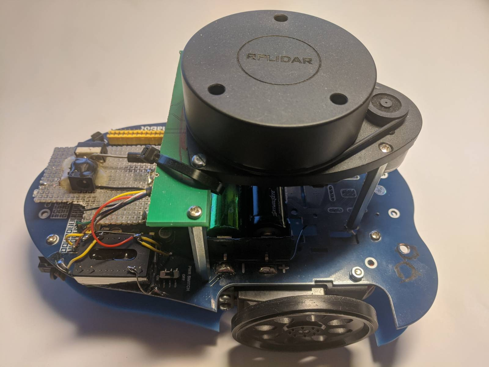

# C++ Alphabot API for the Raspberry PI (customised)



C++ class to control the basic functionality of a customised Alphabot
(https://www.waveshare.com/wiki/AlphaBot) with a Raspberry PI:

 - Motor control (using the Parallax Continuous Rotation Servo)
 - Distance sensor readings (digital and analogue)
 - Battery voltage
 - IR sensor readings
 - 10Hz sampling rate with callback

## Prerequisites

### Parallax Continuous Rotation Servos

Throw the original DC motors in the bin and fit the [Parallax Continuous Rotation Servo](https://www.parallax.com/product/parallax-continuous-rotation-servo/) with 90deg brackets. Plug them into the servo ports S1 and S2.
This corresponds to:
```
GPIO27 = Motor left
GPIO22 = Motor right
```

### Voltage regulator

De-solder the LM2596 and throw it in the bin. It supposed to have a dropout voltage of 1V so that the 7-7.2V from the battery
should be fine but it seems to be more 2V. It's not even recommended by TI who recommend the LMR33630 for new designs.

Replace the LM2596 with a [REC8-0505SRW/H3/A/M](https://onecall.farnell.com/recom-power/rec8-0505srw-h3-a-m/dc-dc-converter-5v-1-6a/dp/2846262). Just glue it upside down on the PCB and run 4 wires to Vin and +5V.

### pigpio
The Raspberry PI hardware is accessed via the
`pigpio` library. Install its package:
```
apt-get install libpigpio-dev
```

### ncurses
The demo programs below display the sensor
readings with the ncurses library. Install
it with
```
apt-get install libncurses-dev
```

## Building

The built system is `cmake`. Just type:
```
cmake .
make
sudo make install
```

## Usage

The online documentation is here: https://berndporr.github.io/alphabot/

### Start/stop

Start the communication with the robot:
```
start()
```

Stop the communication:
```
stop()
```

### Motor speed

Setting the speeds of the left/right wheels:
```
setLeftWheelSpeed(float speed);
setRightWheelSpeed(float speed);
```
where speed is between -1 and +1.

### Get Collision sensor readings

The digital functions are boolean values which are true if the
distance sensor threshold (set with the potentiometer) has been reached:
```
bool getCollisionLeft();
bool getCollisionRight();
```

The analogue readings from the sensors from 0..1 can be read with:
```
float getLeftDistance()
float getRightDistance()
```

### Battery voltage

The function `getBatteryLevel()` provides the voltage of the battery
in volt.

### Infrared channels / general purpose ADC channels 0-4

```
float (&getIR())[nIR]
```
returns a reference to the whole array of IR sensor readings
normalised between 0..1.

### Callback

Whenever a new set of analogue readings is available the callback `step`
in `StepCallback` is called. It contains the reference to the Alphabot
class itself so that one can read the different ADC values.

## Demo programs


`testIO` is a simple test program which displays the different
senor readings and you can test the motors. It also shows
how the callback is used to display the sensor readings.

`testMotor` ramps up the motor speed and back again.

`obstacleAvoid.cpp` implements a Braitenberg vehicle
and it has an emergency stop if the digital readings from
the collision sensors are triggered. This is an
instructional example and needs to be tweaked. The
fun begins here! :)
